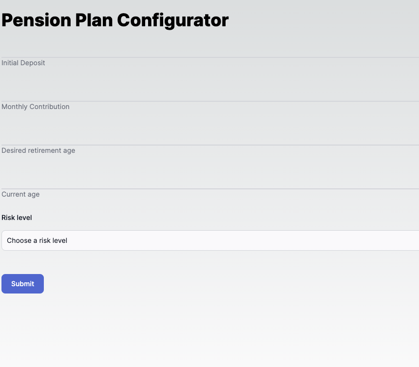

# Numos


# Table of Contents

- [Getting Started](#getting-started)
- [Technology Stack](#technology-stack)
- [Installation](#installation)
- [Testing](#testing)
- [Questions](#questions)
- [Support or Contribution](#support-or-contribution)
- [Status](#status)

## Getting Started
This is a clientside javascript application built [Next JS](https://nextjs.org/) application.

Pension Plan Configuraton             |  Educational Interactive Chart
:-------------------------:|:-------------------------:
  |  


## Technology Stack

**Client Side**
1. Next.Js
2. Netlify


## Installation

1. Install [**Node JS**](https://nodejs.org/en/).

2. Clone the [**repository here**](git@github.com:benfluleck/numos.git)
3. [**cd**] into the root of the **project directory**.
4. Run `pnpm install` on the terminal to install project dependecies

5. Start the application:

**_Build Environments_**

### For Client
**Development**
```
pnpm run dev

Webpack should open your default browser automatically
```
- Navigate to `http://localhost:3000`

### CI/CD
The project uses a combination of Github Actions and Netlify. Each PR is tested and deployed on [here]

## Testing

Client side tests - Run `npm run test` on the terminal while within the **project root directory**.

Client side testing is achieved through the use of `jest` package. `jest` is used to test javascript code in
React applications.

Client side testing is yet to be configured but is being worked on currently

## Questions
For more details contact benfluleck@gmail.com

## Support or Contribution
For any suggestions or contributions or issues please do raise them or email me.
For **Contributiions**, Please clone the repo and implement a PR I would appreciate it

## Status
Still undergoing testing